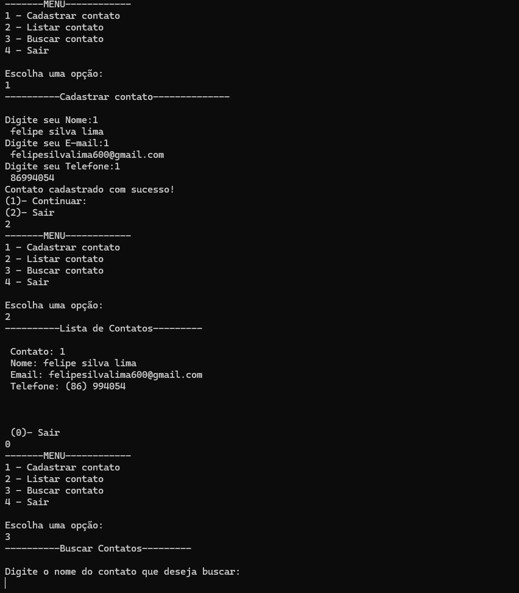

# 📒 Sistema de Agenda de Contatos (C)

Este projeto é um **sistema simples de gerenciamento de contatos** desenvolvido em linguagem C, ideal para estudo de lógica de programação e manipulação de dados. Ele permite **cadastrar, listar e buscar contatos**, simulando uma aplicação de agenda pessoal.

---

## ✅ Funcionalidades

- **Cadastrar Contato**  
  Adicione um novo contato com nome, telefone e e-mail.
  
- **Listar Contatos**  
  Exibe todos os contatos cadastrados em formato organizado.
  
- **Buscar Contato**  
  Permite localizar um contato específico pelo nome.

---

## 🛠️ Tecnologias e Conceitos Utilizados

- Linguagem **C**
- Estruturas de repetição (`for`, `while`)
- Condicionais (`if`, `else`)
- Arrays e manipulação de strings
- Funções para modularização
- Lógica aplicada a sistemas reais

---

## 📷 Demonstração



*(Adicione aqui uma imagem do programa rodando para ficar mais profissional)*

---

## ▶️ Como executar

1. Clone o repositório:
   ```bash
   git clone https://github.com/felipesilvalima/sistema-agenda-contatos-c.git
   
2. Acesse a pasta:
  cd sistema-agenda-contatos-c

3.Compile e execute:
  gcc agenda.c -o agenda/
./agenda
